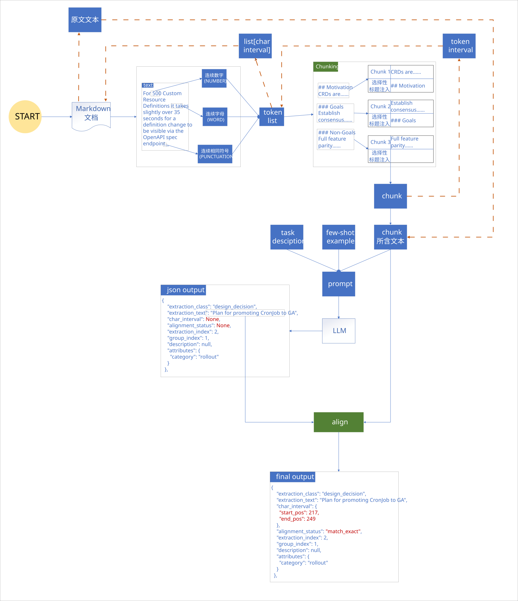
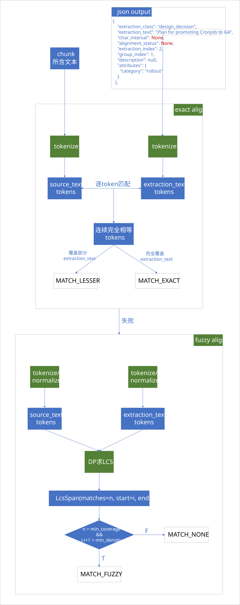
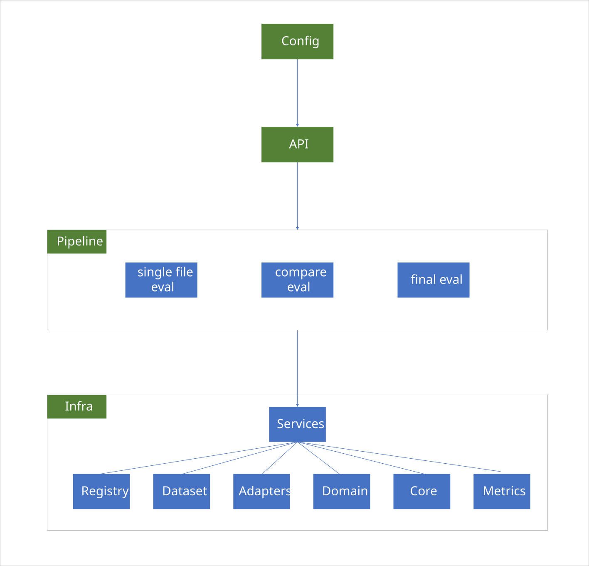
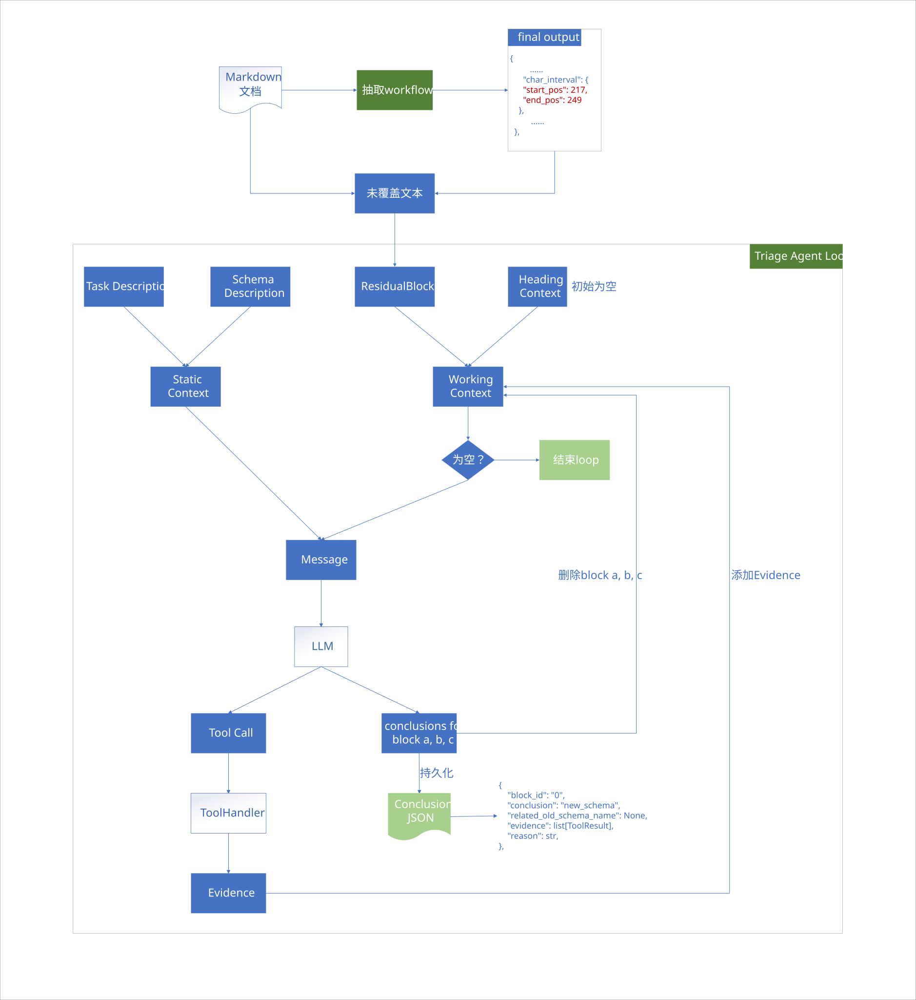
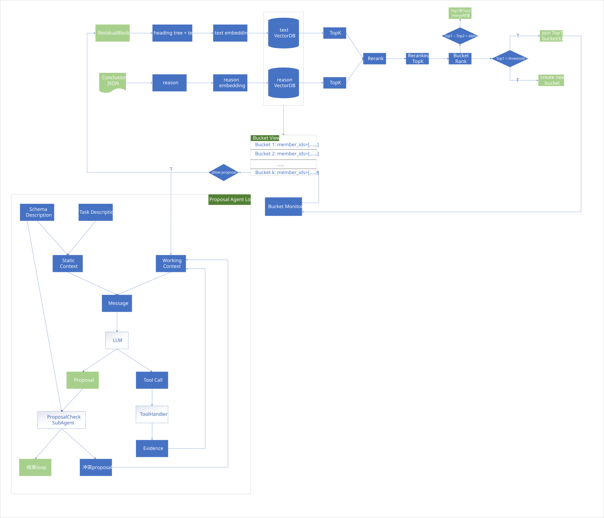

# 技术文档结构化抽取引擎和 Schema 提案 Agent


## 项目动机

技术文档结构化抽取的难点不只是“让 LLM 输出 JSON”。真实技术文档通常存在以下问题：

1. 文档结构复杂，包含标题、列表、表格、链接、代码块、问答模板和长段落；
2. 同一类信息可能分布在不同章节，不能简单按标题等价为 schema；
3. LLM 抽取结果必须能回到原文位置，否则无法审计、评测和人工复核；
4. 业务 schema 会随着文档形态和业务需求演化，固定 schema 很容易遗漏新信息；
5. 未被抽取覆盖的文本并不全是噪声，其中可能包含新的字段、新的语义角色或新的 schema 候选。

因此，本项目尝试构建一个面向技术方案类 Markdown 文档的结构化抽取引擎，并在抽取链路之后引入 residual-driven schema evolution 思路：将未被当前 schema 覆盖的残余文本（Residual）作为弱信号，通过 Agent 流程判断它是噪声、已有 schema 覆盖失败、新属性，还是潜在新 schema。

项目目标不是做一个通用问答 Agent，而是围绕技术文档抽取中的真实工程问题，构建一条可评测、可审计、可迭代的抽取与 schema 演化链路。


## 本项目能做什么

本项目包含两个核心部分：

### 技术文档结构化抽取引擎

面向技术方案类 Markdown 文档的抽取 workflow：

```
Markdown Document
→ tokenize
→ chunking
→ LLM extraction
→ parse / resolve
→ grounding alignment
→ structured output
```

核心能力包括：

- 基于 schema description 进行结构化信息抽取；
- 将 LLM 输出的 extraction 对齐回原文，实现精确 grounding；
- 支持 heading-aware chunking，使 chunk 尽量保留技术文档的局部结构；
- 构建抽取质量评测系统，从 detection、classification、structured extraction 和 grounding 等维度评估效果；
- 通过 error bucket、schema anomaly、grounding status 等诊断信息定位抽取问题。

该部分重点解决的是：**如何让 LLM 抽取结果不仅“看起来正确”，而且能够被定位、评测、复核和迭代。**

### Schema 提案 Agent

在结构化抽取完成后，系统会分析未被当前 schema 覆盖的 residual blocks。Residual 并不直接等价于新 schema，因为其中包含大量噪声、格式残片、链接、标题碎片和已有 schema 的漏抽内容。

因此，本项目设计了两阶段 Agent 架构：

```
Residual Blocks
→ Data Cleaning
→ Triage Agent
→ Bucket
→ Proposal Agent
→ ProposalCheck Sub-Agent
```

其中：

- **Residual Blocks**：结构化抽取后未被当前 schema 覆盖的文本块，是 schema 演化的原始弱信号。它们包含真实新信息，也包含格式残片、链接、标题碎片和已有 schema 的漏抽内容。
- **Data Cleaning** ：用规则过滤高度确定的噪声，如空文本、URL-only、TOC、heading-only、纯编号、Markdown 残片等。该阶段只做高置信清洗，不做复杂语义判断。
- **Triage Agent**：对 residual block 进行证据驱动分流，判断其属于 `noise / existing_schema_covered / new_attr / new_schema / uncertain`。证据不足时调用只读工具补充邻域原文、邻域 extraction 或 heading section context。
- **Bucket**：将 Triage Agent 输出的 `new_attr / new_schema` 信号聚合同类 residual，避免全量结果直接进入 Proposal Agent 导致上下文膨胀和噪声误报。只有支持度足够、状态稳定的 bucket 才触发 proposal。
- **Proposal Agent**：将 Triage 输出的 `new_attr / new_schema` 信号进行聚合，基于 bucket 状态生成候选 schema proposal；
- **ProposalCheck Sub-Agent**：检查候选 proposal 是否与现有 schema 重复、重叠或存在边界冲突。

该部分重点解决的是：**如何从高噪声 residual 中发现 schema 演化信号，而不是让 LLM 直接从零散文本中武断生成新 schema。**


## 技术文档结构化抽取引擎

### 抽取引擎主链路



### align细节



### tokenize

tokenizer 和 LLM 推理中的token无关，而是用于保留原文 offset，服务于 chunk 边界控制和 source grounding。

文档首先被切分为 word / number / punctuation token，每个 token 都保存其在原文中的字符区间。Chunk 不直接依赖字符串截断，而是基于 token interval 构造，因此每个 chunk 都能追溯到原文中的精确位置。

### chunk策略迭代

技术文档的标题层级通常具有很强的语义提示作用。例如，`Motivation`、`Proposal`、`Tests`、`Graduation Criteria` 等标题能显著帮助模型理解局部文本的功能。但在实际抽取中，标题结构和抽取 schema 的语义角色并不完全对齐：

- 一个标题下可能混合多个抽取角色；
- 同一类 schema 可能出现在多个不同章节；
- 某些标题是文档模板结构，不等价于业务语义；
- 过度依赖标题会导致 chunk 边界稳定，但语义边界不一定最优。

因此，项目中对 chunk 策略做了多轮迭代。

1. 初始方案：按标题结构切分

最初采用 heading-based chunking，将 Markdown 文档按标题层级切分，并在 chunk 中保留局部 heading context。

该方案优点是：

- 实现简单；
- 边界稳定；
- 可复现；
- 与技术文档天然结构匹配；
- grounding 和评测链路容易维护。

但问题是：标题边界不一定等于 schema 边界。例如一个 `Proposal` 小节中可能同时包含动机、设计决策、风险、测试计划和未来工作。

2. 尝试方案：LLM 预划分 chunk

为了解决“标题层级与真实语义角色不完全对齐”的问题，项目尝试引入 LLM 预划分策略：先让 LLM 根据文本语义将文档划分为更接近抽取角色的片段，再进入后续抽取流程。

这个方案的预期收益是：

- chunk 边界更贴近语义角色；
- 减少一个 chunk 中混杂多个 schema 的情况；
- 对超长章节或结构混乱文档可能更友好。

但经过评测后发现：

- LLM 预划分在少部分极长文档中有较明显提升；
- 对大多数结构清晰的 KEP 文档，收益不稳定；
- 预划分本身引入额外 token 成本和推理耗时；
- LLM 生成的边界存在不稳定性，影响复现和调试；
- 复杂链路增加了错误来源，不利于定位抽取问题。

因此，LLM 预划分没有作为默认策略保留。

3. 最终方案：标题切分 + 选择性注入标题 context

基于评测结果和工程复杂度 tradeoff，项目回退到更稳定的默认方案：

```
heading-based split
+ selective heading context injection
```

具体思路是：

- 仍以标题结构作为 chunk 的主要边界；
- 对 chunk 注入必要的 heading path，帮助 LLM 理解当前位置；
- 避免把完整标题树无差别塞入 prompt，减少上下文冗余；
- 对极长或结构异常文档，保留 LLM 预划分作为可选实验策略，而不是默认链路。

最终选择该方案的原因是：它在效果、成本、稳定性、可复现性和可调试性之间更均衡。对于技术文档结构化抽取来说，标题是强信号，但不能被当作 schema 的直接替代；更合理的做法是把标题作为上下文提示，而不是完全依赖标题决定抽取语义。

### prompt组装

Prompt 主要包含：

\- 抽取任务说明和 schema 定义
\- few-shot examples
\- 当前 chunk 文本

由于chunk保存的是TokenInterval，而TokenInterval保存的是CharInterval，因此需要用TokenInterval反查其包含的CharInterval，再用CharInterval映射到原文文本，映射到的原文文本即为当前 chunk 文本

### grounding

Grounding 过程优先进行 token-level exact match；如果无法完整精确匹配，则进入 fuzzy match。每个 extraction 会被标记 alignment status：

\- `MATCH_EXACT`：完整精确匹配到原文 span
\- `MATCH_LESSER`：匹配到部分精确 span
\- `MATCH_FUZZY`：通过模糊匹配找到近似 span
\- `None`：未找到可靠原文 span

因此，最终结果不仅包含结构化抽取信息，还包含原文位置和 grounding 状态，可用于结果审计、错误分析和质量评测。

## 抽取质量评测系统

[指标说明文档](eval_system/metrics.md)



### 完整评测流程

1. 用户通过 API 发起评测
2. API 读取 config 并调用 pipeline
3. Pipeline 校验配置
4. Registry service 加载 registry.json
5. Dataset loader 根据 registry 加载 gold docs / labels
6. Prediction adapter 加载模型输出
7. Domain module 校验 schema/class/attribute 合法性
8. Matching core 对 gold 和 prediction 做 strict / relaxed 匹配
9. Metrics modules 计算 detection / class / structured / grounding / anomaly 指标
10. Aggregation core 聚合 micro / macro / per-doc / per-class 结果
11. Error bucket 模块生成错误归因和 error samples
12. Report service 输出报告

## Schema 提案 Agent

### 分流Agent



### 提案Agent



## 示例

### 抽取

- [抽取prompt](example/extraction/KEP_prompt_v2.md)
- [抽取结果](example/extraction/extraction_output.json)

### 评测

- [评测报告](example/eval/summary_report.md)

### agent

* [schema description](example/agent/prompt/KEP_schema_v2.json)
* [residual blocks](example/agent/residual_blocks.json)
* [分流agent prompt](example/agent/prompt/TriageAgentSkill.md)
* [提案agent prompt](example/agent/prompt/ProposalAgentSkill.md)
* [提案检查subagent prompt](example/agent/prompt/ProposalCheckAgentSkill.md)
* [分流 agent 输出](example/agent/triage_result.json)

- [提案 agent 输出](example/agent/proposal.json)

  
